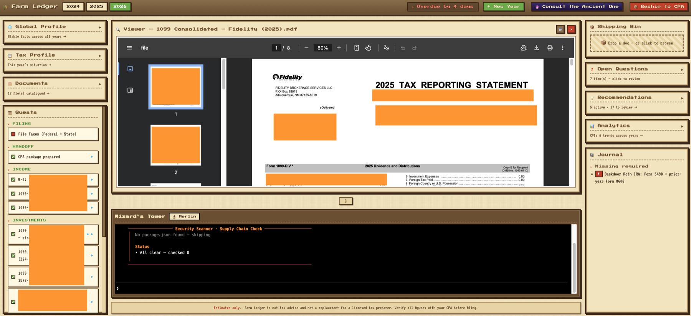
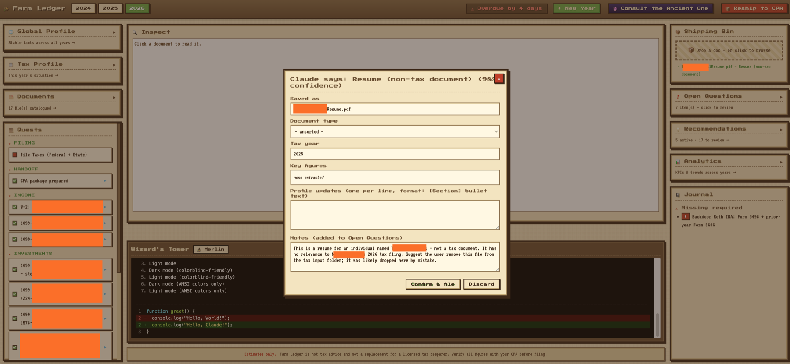
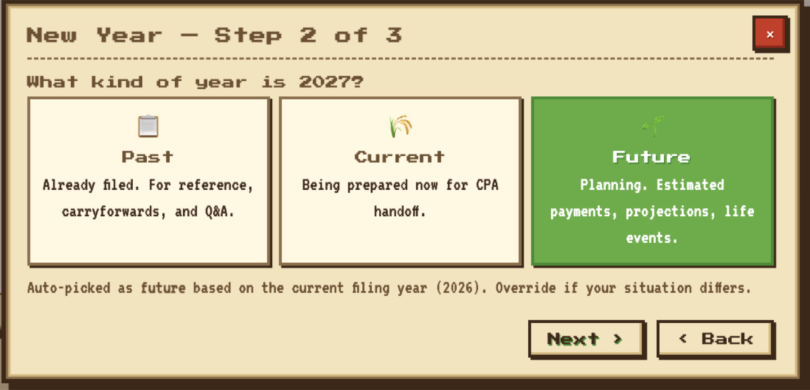
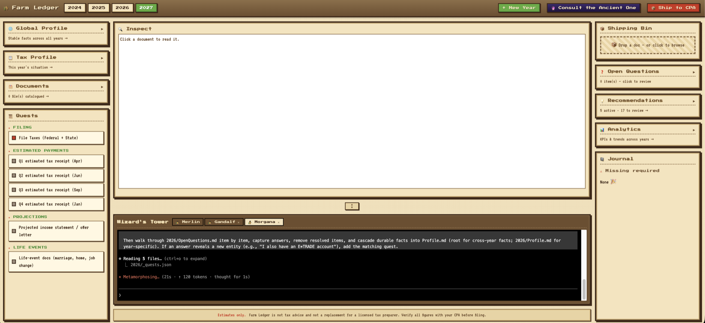

# Farm Ledger 🌾

**A local, AI-assisted tax workspace that turns "the annual shoebox of documents" into a CPA-ready package.**

Farm Ledger is a Stardew-themed macOS app that helps you organize your tax documents across multiple years, track what's still missing, and hand off a clean package to your CPA. It runs entirely on your machine, and uses a live Claude Code terminal as a conversational interface to your own files.



---

## The problem

Tax prep tools today are built for one of two people:

- **Filers who DIY in TurboTax** — the product is a giant wizard that funnels you toward e-filing, not toward understanding or organizing your situation.
- **Accountants who use pro software** — designed for batch client management, not for a single filer working with their own CPA.

**The person who works _with_ a CPA has no tool at all.** They end up in a loop of PDF exports, Dropbox links, and emails titled "Re: Re: Re: follow-up questions for 2024." Every year they restart from scratch and every CPA-bound question lives in a different thread.

Farm Ledger is built for that gap: the handoff workspace. Its end goal is never a filed return — it's a **clean, organized, auditable package** that a CPA can open and use.

## What it does



- **Drop documents into a Shipping Bin** — Claude classifies each one (W-2, 1099-B, 1098-E, etc.), renames it to a consistent convention, and proposes updates to your Profile, document inventory, and open questions. You approve every change in a modal before anything is saved.
- **Three markdown files per year** — `Profile.md`, `Files.md`, `OpenQuestions.md`. Human-readable, human-editable, diffable in git if you want.
- **One cross-year profile** — durable identity (name, filing status, dependents) lives in a single file that evolves with your life, not your tax year.
- **Quest log** — a per-year checklist of "documents you're expected to have" (one quest per employer, one per brokerage, etc.). Personalizes itself as documents arrive.
- **Wizard's Tower terminal** — a Claude Code session running inside the UI with full read/write access to your workspace. Five slash commands keep profile/questions/documents in sync via conversation rather than forms.
- **Year types** — each year is marked `past` (already filed, Q&A only), `current` (being prepared now), or `future` (planning). Templates and checklists differ accordingly; a past year doesn't nag you for "missing" documents.

  

- **Wizard's Tower conversation** — ask Claude anything about your workspace; it reads the markdown files and answers.

  

- **CPA handoff** — one click zips everything into a dated package.
- **Live updates** — Server-Sent Events refresh the UI the moment any file changes, whether edited in VS Code, in the terminal, or through the UI.

## Design decisions (and the tradeoffs)

A few choices that are worth calling out, because they are not the obvious defaults:

### 1. Markdown files as the database

There is no SQLite, no JSON blob, no server-side schema. Every fact about your tax life lives in a plain `.md` file you can open in any editor.

- **Why**: Longevity (you can read a markdown file in 20 years), transparency (no black-box state), and delegation-friendly (an AI agent can read and edit a markdown file in the same way a human can).
- **The tradeoff**: No queries, no joins, no atomic transactions. For a single-user, dozens-of-files workspace, that's fine. For multi-tenant SaaS it would be wrong.

### 2. Local-only, no cloud sync

The app binds to `127.0.0.1`. There is no server, no account, no upload path. Your tax documents never leave your machine.

- **Why**: The average filer's document pile contains SSNs, income history, and bank account numbers. "Trust us, it's encrypted" is not the right pitch for that data.
- **The tradeoff**: No cross-device access. If you want to work from a second laptop, you're responsible for syncing (e.g., encrypted iCloud Drive or a USB dongle).

### 3. AI as interface, not as source of truth

Claude reads your files, proposes changes, and writes the next edit — but every write goes through a confirmation modal or a slash command the user explicitly invokes. The AI never silently commits a number to Profile.md.

- **Why**: Tax documents are legal records. An AI that "helpfully" decides your filing status is a liability, not a feature.
- **The tradeoff**: More clicks than a fully autonomous workflow. Acceptable, because the cost of a wrong number is real money.

### 4. Years as first-class, not tabs

Each tax year is its own folder with its own profile, its own document inventory, its own open questions. Facts from year N do **not** automatically propagate to year N+1.

- **Why**: Life changes. Marital status, state of residency, employer, dependents — all of these shift year over year, and a tool that silently carries last year's answer forward will produce quietly wrong filings.
- **The tradeoff**: Some duplication. Worth it.

### 5. Three year-types with different behaviors

`past` / `current` / `future` each get a different template, a different quest checklist, and different AI prompts. A past year exists to answer questions ("how much did I contribute to the HSA in 2023?") — it doesn't need a missing-document nag screen.

- **Why**: A tool that treats every year identically ends up treating none of them well.

## Roadmap

Rough priorities, not commitments:

- **Screenshots + 90-second demo GIF** — the highest-leverage next artifact.
- **Fictional-persona demo mode** — so a reviewer can clone the repo and see a populated workspace without needing their own tax docs.
- **Windows / Linux launcher parity** — currently Mac-only because of the `.app` bundle and LaunchServices integration.
- **Cross-year delta view** — "what changed between 2024 and 2025" as a first-class screen.
- **Two-way CPA channel** — export format the CPA can annotate and send back, closing the loop.

## Requirements

- **macOS** (the `.app` bundle + LaunchServices integration are Mac-specific)
- **Homebrew** for installing the three runtime dependencies

## First run

1. Clone this repo anywhere on disk.
2. **Install system dependencies** — from the repo root:
   ```
   brew bundle
   ```
   This installs `python@3.12`, `node`, and `ttyd`.
3. **Install the Claude Code CLI** (published on npm):
   ```
   npm install -g @anthropic-ai/claude-code
   ```
4. **Authenticate the Claude CLI** (one-time):
   ```
   claude
   ```
   Follow the prompts to sign in. The Wizard's Tower pane and the document classifier both call this CLI — they won't work until it's authenticated.
5. **Launch the app** — preferred: double-click **`Launch Taxes.command`**. Terminal will flash briefly and close on its own.
   - Alternative: double-click **`Farm Ledger.app`**. On first launch macOS Gatekeeper will refuse to open it because the bundle isn't notarized; **right-click → Open → Open** in the confirmation dialog, once. If Gatekeeper still blocks it, fall back to `Launch Taxes.command`.
6. The browser opens to `http://127.0.0.1:5173` and a welcome wizard runs:
   - Asks for your name, filing status, residency, dependents → writes `Farm Ledger/YearData/MDDocs/Profile.md`.
   - Prompts for a first year folder.
7. Start dropping documents into the Shipping Bin and/or chatting with Claude in the Wizard's Tower pane.

Delete any of the markdown files and the app regenerates them from templates on next launch.

## What lives where

```
Farm Ledger/                  The app code (Flask + static assets).
  app.py
  checklist.py                ← Edit to customize which documents your checklist expects.
  CLAUDE.md.template          ← Master copy used to restore CLAUDE.md if the user removes it.
  static/ templates/
  requirements.txt
  YearData/                   All user data (gitignored). Created on first launch.
    MDDocs/
      Profile.md              Cross-year identity.
      Analytics.md            Auto-generated cross-year dashboard.
    <YEAR>/                   One folder per filing year, created via the UI's "+ New Year" wizard.
      Profile.md, Files.md, OpenQuestions.md, _meta.json, input/

CLAUDE.md                     Instructions the Wizard's Tower Claude reads.
.claude/commands/*.md         Slash commands available in the Wizard's Tower.
Farm Ledger.app               Double-clickable launcher.
Launch Taxes.command          Fallback terminal launcher.
```

## Configuration

Environment variables read at startup:

- `FARM_LEDGER_DATA_ROOT` — override the data directory. Defaults to `Farm Ledger/YearData/`. Useful for Docker volume mounts, encrypted disks, or test fixtures.

## Customizing the checklist

`Farm Ledger/checklist.py` ships with generic slots (W-2, 1099-B, 1098-E, etc.). Edit it to match your actual employers, brokerages, and benefits — the filenames you drop in will match slot names automatically.

## Privacy

- **Your tax documents never leave your machine.** The app binds to `127.0.0.1` only; `input/` files are read, classified, and renamed entirely on your local filesystem.
- **Document classification is done by the Claude CLI you're already signed into** — no separate API key is stored, no third-party service sees your documents beyond what Anthropic normally receives when you use Claude Code.
- **The UI is fully self-contained.** All assets — fonts, icons, styles — are served from the local Flask server. No CDN calls, no analytics, no telemetry.
- **The only outbound network traffic** comes from the `claude` CLI (model inference against Anthropic's API, authenticated as you) and from Homebrew when you install or upgrade dependencies. The Farm Ledger code itself makes no outbound requests.

## Acknowledgements

- UI typefaces: [Press Start 2P](https://fonts.google.com/specimen/Press+Start+2P) and [VT323](https://fonts.google.com/specimen/VT323), both under the SIL Open Font License.
- Visual inspiration: Stardew Valley by ConcernedApe.
- Built with Claude Code.

## License

MIT. See [`LICENSE`](LICENSE).
